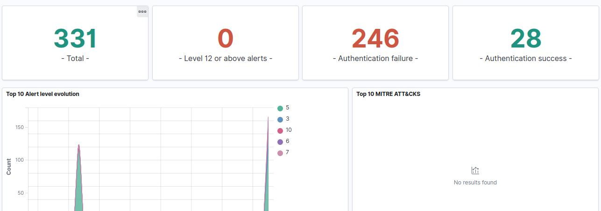
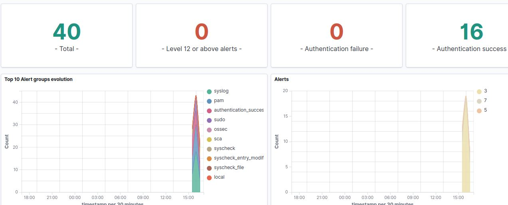
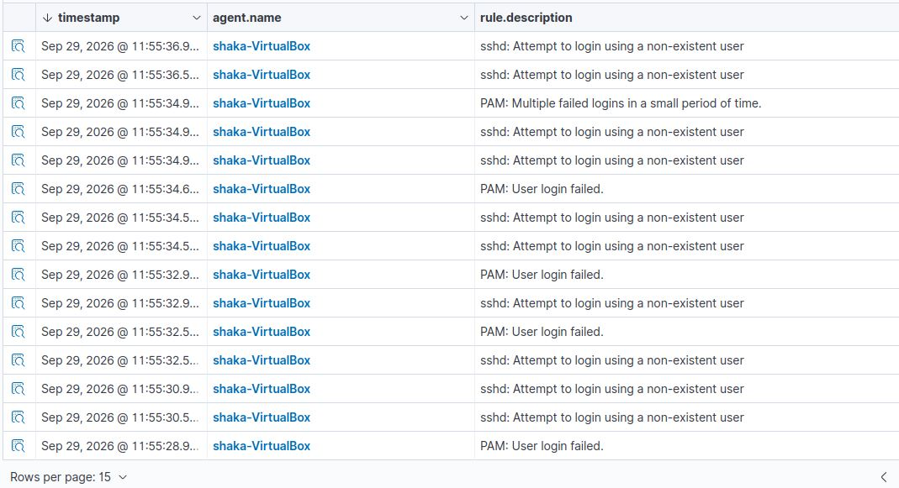
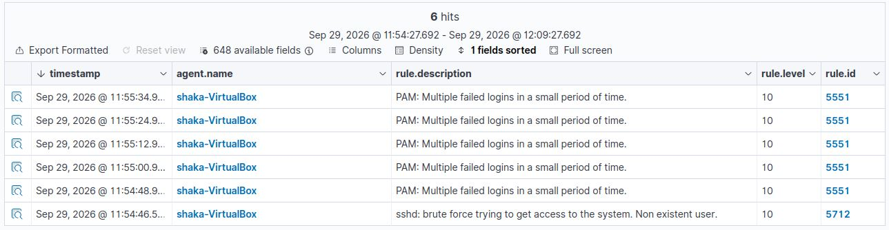
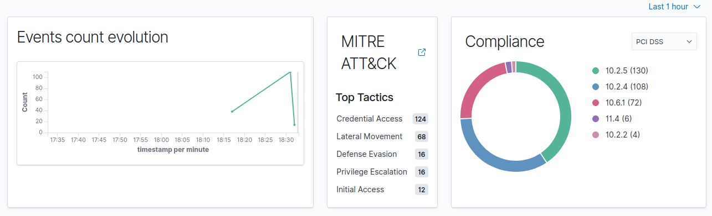
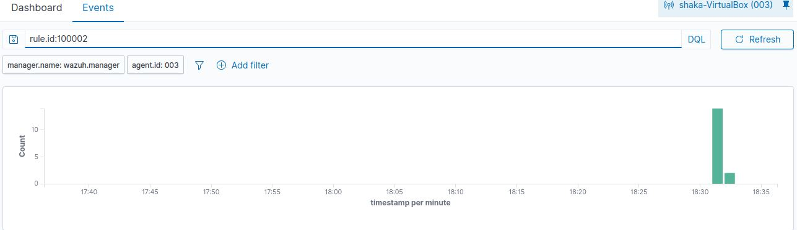
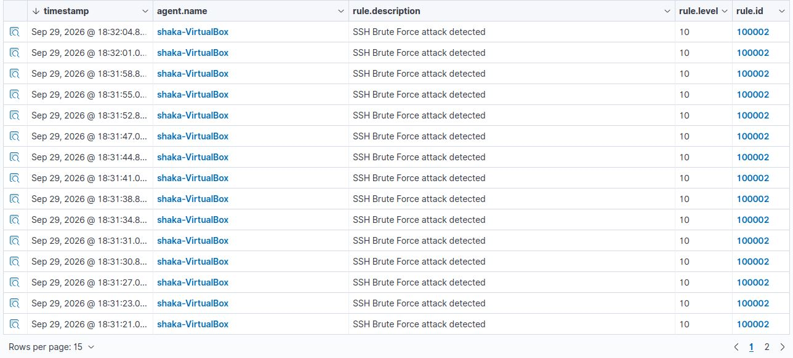

# Mini-SOC-with-Wazuh-
Detection Attacks SSH and MITRE ATT&amp;CK


## 📑 Índice

1. [Descripción General](#-descripción-general)
2. [Objetivos](#-objetivos)
3. [Arquitectura del Laboratorio](#-arquitectura-del-laboratorio)
4. [Tecnologías Utilizadas](#-tecnologías-utilizadas)
5. [Configuración Clave](#-configuración-clave-del-laboratorio)
6. [Guía de Implementación](#-guía-de-implementación)
7. [Evidencia de Detección](#-evidencia-de-detección)
8. [Resultados y Métricas](#-resultados-y-métricas)
9. [Casos de Uso Demostrados](#-casos-de-uso-demostrados)
10. [Lecciones Aprendidas](#-lecciones-aprendidas)
11. [Troubleshooting](#-troubleshooting)
12. [Referencias y Recursos](#-referencias-y-recursos)
13. [Descargo de Responsabilidad](#-descargo-de-responsabilidad)
14. [Autor](#-autor)
15. [Licencia](#-licencia)


## 📖 Descripción General

Laboratorio práctico de Seguridad de la Información que implementa un **mini SOC (Security Operations Center)** funcional utilizando **Wazuh SIEM/XDR** sobre Docker. El proyecto demuestra el ciclo completo de detección de amenazas: desde la implementación del agente en un endpoint Linux Mint, hasta la detección de un ataque de fuerza bruta SSH y la correlación con el framework **MITRE ATT&CK**.


## 🎯 Objetivos

- ✅ **Implementar** Wazuh SIEM en contenedores Docker
- ✅ **Configurar** agente enpoint en Linux Mint para recoleccion de logs
- ✅ **Simular** ataque de fuerza bruta SSH de forma controlada
- ✅ **Crear** regla personalizada con mapeo MITRE ATT&CK T1110
- ✅ **Validar** la deteccion y visualizacion en el dashboard
- ✅ **Documentar** el proceso completo de la forma reproducible

## 🏗️ Arquitectura del Laboratorio

### Diagrama de Componentes


### Diagrama de Flujo de Ataque y Defensa


### Inventario de Activos

| Rol | Sistema Operativo | Software | Función |
|-----|------------------|----------|---------|
| **Servidor SOC** | Ubuntu Server | Docker + Wazuh (Manager, Indexer, Dashboard) | Centralización, análisis y visualización |
| **Endpoint Monitorizado** | Linux Mint | Wazuh Agent + rsyslog | Recolección de logs y detección local |
| **Atacante (simulado)** | Linux Mint (localhost) | sshpass | Generación de eventos de fuerza bruta |


## 🏗️ Tecnologías Utilizadas

| Categoría | Herramienta | Versión |
|-----------|-------------|---------|
| **SIEM/XDR** | Wazuh Manager + Indexer + Dashboard | 4.13.1 |
| **Contenedores** | Docker + Docker Compose | Ultima estable
| **Endpoint**| Linux Mint | Basado en Ubuntu 24.04 |
| **Agente** | Wazuh Agent | 4.13.1 |
| **Logging** | rsyslog | Sistema |
| **Ataque** | sshpass | Sistema |
| **Framework** | MITRE ATT&CK | v14 |


## 🏗️ Configuracion Clave

### Regla Personalizada (`config/wazuh_cluster/local_rules.xml`)

<group name="local,syslog,sshd,">
  <rule id="100002" level="10" frequency="8" timeframe="120" ignore="60"> 
    <if_matched_sid>5712</if_matched_sid>
    <same_srcip />
    <description>SSH brute force dectectado (regla personalizada con MITRE).</description>
    <mitre>
      <id>T1110</id>
      <tactic>Credential Access</tactic>
      <technique>Brute Force</technique>
    </mitre>
  </rule>
</group>
 

### Volumen Docker para Montar Reglas (`docker-compose.yml`)

```yaml
services:
  wazuh.manager:
    volumes:
      - ./config/wazuh_cluster/wazuh_manager.conf:/wazuh-config-mount/etc/ossec/.conf
      - ./config/wazuh_cluster/local_rules.xml:/var/ossec/etc/rules/local_rules.xml
```

### Configuracion del Agente para leer endpoint `auth.log` (`/var/ossec/etc/ossec.conf`)

```xml
<localfile>
  <log_format>syslog</log_format>
  <location>/var/log/auth.log</location>
</localfile>
```


### Script de Ataque (simulate_bruteforce.sh)

```bash
  #!/bin/bash
  # ==========================================
  # Simulacion de brute force SSH -MITRE T1110
  # Ejecutar en el endpoint (Linux Mint)
  # ==========================================

  INTENTOS=20

  # Verificaciones previas
  command -v sshpass &>/dev/null || sudo apt install sshpass -y
  systemctl is-active --quiet ssh || { echo "[!] SSH no activo"; exit 1; }
  systemctl is-active --quiet rsyslog || sudo systemctl start rsyslog
  [ -f /var/log/auth.log ] || { echo "[!] Falta auth.log"; exit 1; }

  echo "[*] Lanzado ${INTENTOS} intentos contra fakeuser@localhost..."
  for i in $(seq 1 ${INTENTOS}); do
          sshpass -p "wrongpass${i}" ssh fakeuser@localhost \
                  -o StrictHostKeyChecking=no \
                  -o ConnectTimeout=1 \
                  -o PreferredAuthentications=password \
                  2>/dev/null
            echo "[+] Intento ${i}\${INTENTOS}"
  done
  echo "[ok] Ataque completado. Filtra en el dashboard: rule.id:100002"
```


### Configuracion del Cliente Wazuh en el Agente (`/var/ossec/etc/ossec.conf`)

```xml
  <client>
    <server>
      <address>IP_DEL_MANAGER</address>
      <port>1514</port>
    </server>
    <config-profile>linuxmint, linuxmint22, linuxmint22.3</config-profile>
    <notify_time>20</notify_time>
    <time-reconnect>60</time-reconnect>
    <auto_restart>yes</auto_restart>
    <crypto_method>aes</crypto_method>
  </client>
```


## 🚀 Guía de Implementacion

### Requisitos Previos

- **Docker** y *Docker Compose* instalados ([guía oficial](https://docs.docker.com/get-docker/))
- **Al menos 8 GB de RAM** disponibles en el host (Wazuh Indexer consume ~2 GB)
- **Puertos libres**: 443(Dashboard), 9200(Indexer), 1514(Manager), 55000(API)
- **Agente Wazuh** instalado en un endpoint Linux ([guía oficial](https://documentation.wazuh.com/current/installation-guide/wazuh-agent/index.html))
- **Conocimientos básicos** de Docker y linea de comandos Linux


### Paso 1: Despliegue del Servidor Wazuh

```bash
#Clonar repositorio
git clone https://github.com/tu-usuario/wazuh-mini-soc.git
cd wazuh-mini-soc

#Iniciar Stack
docker compose up -d
```

### Paso 2: Configuracion del Agente (Linux Mint)

```bash
#Instalar rsyslog para generar auth.log
sudo apt install rsyslog -y

#Editar configuracion del agente
sudo nano /var/ossec/etc/ossec.conf

#Añadir bloque de localfile para auth.log

#Reiniciar agente
sudo systemctl restart wazuh-agent
```

### Paso 3: Simulación del Ataque

```bash
#En Linux Mint
bash scripts/simulate_bruteforce.sh
```


## 🔍 Evidencia de Detección

### Ejecucion del Ataque

El script `simulate_bruteforce.sh` se ejecuta en el endpoint (Linux Mint) y lanza 20 intentos de autenticacion SSH fallidos:

```
[*] Lanzando 20 intentos contra fakeuser@localhost...
[+] Intento 1/20
[+] Intento 2/20
[+] Intento 3/20
...
[+] Intento 19/20
[+] Intento 20/20
[OK] Ataque completado. Filtra en el dashboard: rule.id:100002
```

Cada intento genera un evento `Failed password` en `/var/log/auth.log`, que el agente Wazuh lee y envia al manager.


El dashboard muestra **246 fallos de autenticación** concentrados en un pico temporal, evidencia del patrón de fuerza bruta




### Alerta de Fuerza Bruta SSH

| Campo | Valor |
|-------|-------|
| **Rule ID** | 100002 |
| **Level** | 10(High) |
| **Description** | SSH brute force detectado |
| **Agent** | namePC-VirtualBox (003) |
| **MITRE ID** | T1110 |
| **MITRE Tactic** | Credential Access |
| **MITRE Technique** | Brute Force |


### Capturas de pantalla

**1. Dashboard principal con el pico del ataque**



| Descripcion del Dashboard |
|---------------------------|
| Total de valor 40 eventos detectados |
| Level 12 de valor 0 ninguna alerta supera el nivel 12 |
| Authentication failure de valor 0 contador global del dashboard |
| Authentication de valor 16 Logins existosos legitimos del sistema |

<br>

**2. Alertas de intentos de autenticacion fallidos**

Al filtrar los eventos del agente `shaka-VirtualBox`, se observan múltiples alertas de `sshd: Attempt to login using a non-existent user` y `PAM: User login failed`, evidencia directa del ataque de fuerza bruta



<br>

**3. Reglas disparadas durante el ataque**

El filtro por `rule.level:10` muestra las alertas de alta severidad generadas durante el ataque, incluyendo la regla **5551** (PAM: multiples logins fallidos) y la regla **5712** (SSH Brute Force intentando acceder al sistema)



<br>


**4. Mapeo MITRE ATT&CK confirmado en el dashboard**

El panel **MITRE ATT&CK -> Top Tactics** confirma que el dashboard clasifica correctamente las alertas del ataque, destacando la tactica **Credential Access** con **124 eventos**, evidencia directa de la deteccion de la tecnica **T1110 (Brute Force)**



<br>

**5. Alertas de la regla personalizada (rule.id:100002)**

Filtrando por el ID de nuestra regla personalizada, se confirma que las alertas del ataque estan siendo procesadas por la regla **100002**




<br>


## 📊 Resultados y Métricas

| Métrica | Valor |
|---------|-------|
| Eventos totales detectados | numero |
| Alertas de fuerza bruta | numero |
| Severidad maxima | Level numero |
| Tiempo de deteccion | < numero segundos |
| Falsos positivos | numero |


## 🎯 Casos de Uso Demostrados

| Caso de uso | Tecnica MITRE | Estado |
|-------------|---------------|--------|
| Deteccion de fuerza bruta SSH | T1110 - Brute Force | Implementado |
| Monitoreo de integridad de archivos criticos | T1565 - Data Manipulation | Implementado
| Deteccion de login con usuario inexistente | T1078 - Valid Accounts | Implementado
| Analisis forense de alertas | - | Documentado


## 🎓 Lecciones Aprendidas

- **Gestion de puertos en Docker**: Los conflictos de puertos (443, 9200, 514) requirieron limpieza manual de `docker-proxy` huerfanos tras fallos de arranque. Antes de reintentar se debe hacer `docker compose down`
- **Validacion de reglas personalizadas**: Descubrimiento que Wazuh no procesa bloques `<rule>` dentro de `ossec.conf`; deben ir en archivos `.xml` separados dentro de `etc/rules/`
- **Sintaxis estricta de reglas**: El motor de reglas rechaza grupos vacios (`<group>` sin `<rule>` dentro). Uso de `wazuh-logtest` para validar antes de reiniciar.
- **FIM en tiempo real**: La frecuencia por defecto de `syscheck` es 12 horas. Para demos agiles, es necesario configurar `realtime="yes"` o bajar la `frequency`.


## 🔧 Troubleshooting

### Problema API

API connection `API is down` despues de reiniciar el manager o modificar la configuracion.

### Causa

No arranca correctamente debido a error de configuracion o servicio API interno (wazuh-apid) tarda de lo normal en estar disponible. El dashboard no puede conectar con la API en el puerto 55000.


 **Verificar el estado del contenedor** <br>
 ```bash
 docker compose ps
 ``` 
 <br><br>
 
 **Revisar logs del manager** <br>
 ```bash
 docker compose logs --tail=50 wazuh.manager
 ``` 
 <br><br>

 **Pulsar Refresh y esperar entre 2 a 3 minutos** <br>
 ```bash
 docker compose down
 docker compose up -d
```
  <br><br>


### Problema Rule

Rule personalizada no se dispara

### Causa

Errores comunes en la sintaxis del archivo local_rules.xml

  **Verificar que el archivo este montado**
  ```bash
  docker compose exec wazuh.manager cat /var/ossec/etc/rules/local_rules.xml
  ```

  ```bash
  docker compose exec wazuh.manager /var/ossec/bin/wazuh-control status
  ```

  **Asegurar que el contenido este dentro de un bloque <group>**
  ```xml
  <group name="local,syslog,sshd,">

      <rule id="100002" level="10" frequency="5" timeframe="120">
        <if_matched_sid>5710</if_matched_sid>
        <description>SSH Brute Force attack detected</description>
        <mitre>
          <id>T1110</id>
        </mitre>
      <group>authentication_failures,brute_force,</group>
      </rule>

    </group>
  ```
  
  **Restar el Docker**
  ```bash
    docker compose restart wazuh.manager
  ```

  ```bash
    docker compose logs --tail=100 wazuh.manager
  ```

  **Validad regla con wazuh-logtest**
  ```bash
  docker compose exec wazuh.manager /var/ossec/bin/wazuh-logtest
  ```
    
## 📚 Referencias y Recursos

### Documentación Oficial
- [Wazuh Documentation](https://documentation.wazuh.com/)
- [Wazuh Custom Rules](https://documentation.wazuh.com/current/user-manual/ruleset/rules/custom.html)
- [Wazuh Docker Deployment](https://documentation.wazuh.com/current/deployment-options/docker/index.html)

### Frameworks
- [MITRE ATT&CK T1110](https://attack.mitre.org/techniques/T1110/)
- [MITRE ATT&CK Framework](https://attack.mitre.org/)

### Recursos Complementarios
- [Wazuh Community](https://wazuh.com/community/)
- [Docker Compose Documentation](https://docs.docker.com/compose/)


## ⚠️ Descargo de Responsabilidad

Proyecto diseñado **exclusivamente con fines educativos y de investigacion en ciberseguridad**. Las tecnicas de ataque simuladas (fuerza bruta SSH, modificaciones de archivos del sistema) deben ejecutarse **unicamente en entornos controlados y con autorizacion explicita**.

El autor no se responsabiliza del uso indebido de este material. Aplicar estas técnicas contra sistemas sin autorización constituye un delito en la mayoría de jurisdicciones.

## Autor

**ForME**
- Portfolio:
- Github:

## Licencia

Licencia MIT.
